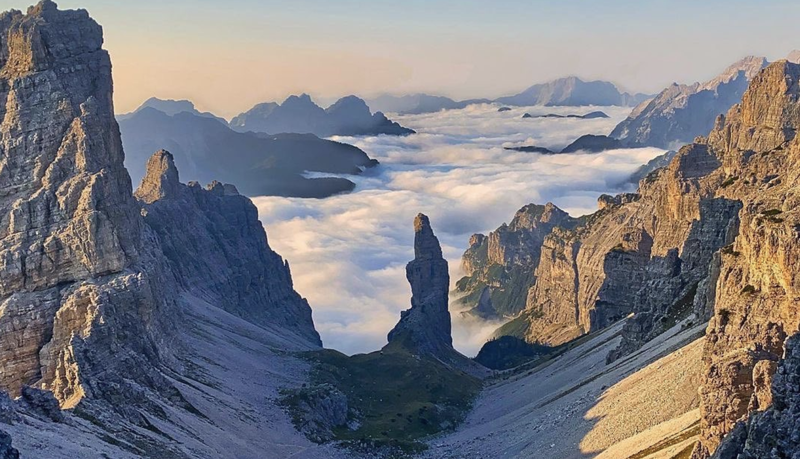

|  | 
|:--:| 
| *Campanile Val Montanaia - Parco Naturale Dolomiti Friulane. Home.* |

### Hi all! 👋

Trained as cognitive neuroscientist and data scientist,  I am now working as a software developer and data scientist at AlmaViva SpA and collaborating
with Fondazione Bruno Kessler at Digital Commons Lab.

👁️ 🧠 I’m working on eye-tracking and EEG remote rehabilitation project using VR and data science skills.

💻 I’m currently learning sophisticated network analysis, prediction and geospatial techniques. 

##### Contacts 📫

[Lab website](https://dcl.fbk.eu/) and 

    
        

&nbsp;

